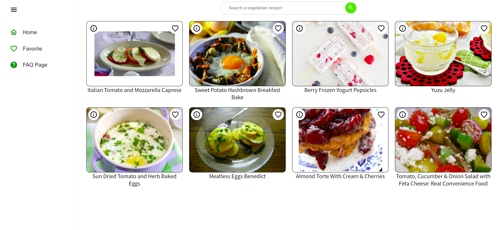

# Recipe Searcher

## Table of Contents
* [Description](#description)
* [Technologies](#technlogies)
* [Dependencies](#dependencies)
* [Installation](#installation)
* [Try It!](#try-it)
* [License](#license)
* [Contact Me](#contact-me)

## Description
This is an application that helps you to find vegetarian recipes through [Spoonacular API](https://spoonacular.com/food-api/docs).

The interface of the application is very simple, when you open the app it shows 8 random recipes, once you open a recipe it shows all the available details about that recipe. 

The user can also search a specific recipe through the dedicated search bar. 

Each recipe can be saved on **Favorite** section, but keep in mind they are saved on localStorage, therefore they will be reset when you clear browser's history.

## Technologies
  
  

## Dependencies
* [DOMPurify](https://github.com/cure53/DOMPurify)
* [Axios](https://axios-http.com/)
* [MUI](https://mui.com/)
* [React-Pro-Sidebar](https://github.com/azouaoui-med/react-pro-sidebar)

## Installation
First of all, you need Node.js installed, you can download it [here](https://nodejs.org/it/download/).

1. Clone the repository: `git clone https://github.com/cavaliernicola/Recipe-Searcher.git`
1. Install the dependencies: `npm install`
1. Remove `.example` extension from `.env` file
1. Set your own `VITE_API_KEY` on `.env` file
1. Build the app: `npm run build`

*Make sure to run production build and not development, otherwise you might experience unwanted re-render due to live compiling.*

## Try It!
You can try this app [HERE](https://taupe-tapioca-b5f2c0.netlify.app/)!

## License
Distributed under the MIT License. See [`LICENSE`](LICENSE) for more information.

## Contact Me
* Author: Nicola Cavalier 
* Email: cavaliernicola@gmail.com
